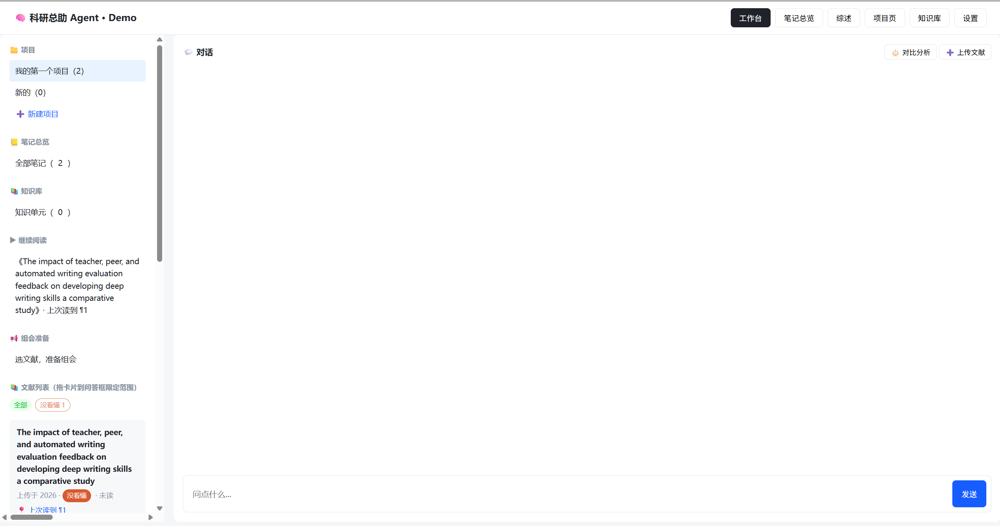

# literature-assistant · 文献管理助手

> 对话驱动的私有文献库 + 文献笔记助手。上传 PDF 后，用自然语言完成**速读、对比、问答、综述、笔记、复现**，每一句结论都能点回原文段落。

本地优先：文献正文、向量库、笔记全部存在本机 SQLite / Chroma 里，只有调用大模型时才联网。



## 技术栈

| 层 | 选型 |
| --- | --- |
| 后端 | FastAPI + Uvicorn |
| 存储 | SQLite（`backend/data/app.db`）+ Chroma 向量库（`chroma_db/`） |
| 大模型 | 阿里云百炼 DashScope：`qwen-turbo`（生成）+ `text-embedding-v2`（向量） |
| PDF 解析 | PyMuPDF（按坐标分栏，双栏论文不串行） |
| 前端 | 单文件 `demo/index.html`，原生 JS，无需打包 |

## 快速开始

```bash
# 1. 安装依赖（Python 3.10+）
pip install -r requirements.txt

# 2. 配置 API Key
cp .env.example .env
#   编辑 .env，填入 DASHSCOPE_API_KEY=sk-你的key

# 3. 启动后端
python run.py
#   健康检查：http://127.0.0.1:5000/api/health
#   接口文档：http://127.0.0.1:5000/docs

# 4. 打开前端
#   直接双击 demo/index.html 即可
```

前端会自动探测 `5000 → 5001 → 5057` 上的后端；连不上时页面顶部会出现提示条，此时展示的是离线示例数据。Windows 下若 5000 端口被占，可双击 `restart_backend.bat`。

## 核心机制：两套分段严格分离

这是整个项目最关键的设计，改动时不要混用：

| 用途 | 函数 | 规则 | 服务于 |
| --- | --- | --- | --- |
| 检索 | `split_for_rag` | 500 字、重叠 50、允许断句 | 向量召回、问答 |
| 阅读 | `split_for_reading` | ≤700 字、只在句末切、不重叠 | 阅读页 `¶N` 锚点、溯源跳转 |

阅读分段还会还原行末连字符与 PDF 连字（`fi fl ff`），否则大模型摘的原句永远匹配不上正文，溯源和高亮会失效。

## 功能

- **文献入库**：PDF 上传、批量上传、按内容去重、软删除与回收站
- **速读 / 深解析**：11 字段结构化卡片（主旨、方法、结论、局限性、金句等），逐句溯源校验，校验不过拒绝入库
- **智能检索问答**：单篇问答、跨文献问答、查询改写，答案带来源锚点
- **对比分析**：2~6 篇多维度对比表，每格可跳回原文，并生成 200~400 字总结
- **综述生成**：Markdown-lite 正文 + 参考文献，带 `[1]` 引用标注，支持引用密度与争议标注
- **笔记与划线**：段落级笔记 + 版本链 + 关联笔记，可导出 Markdown
- **知识库**：从笔记收藏知识单元，保留 `source_doc_id` + `source_pid` 可跳回原文
- **标签体系**：独立 `tags` 表，支持颜色、`topic` / `status` 两类；`status` 互斥（已读 ⇄ 未读）；全局改名与删除
- **项目 / 专题**：总库超集、项目子集，项目名不重复

溯源失败会**标红显示**，缺口如实汇总，不编造内容。

## 目录结构

```
literature-assistant/
├── run.py                  # 统一启动入口（检查 .env 与依赖后拉起 FastAPI）
├── restart_backend.bat     # Windows 重启脚本（5000 被占自动换 5001）
├── requirements.txt
├── .env.example            # 复制为 .env 后填 Key
├── PRD.md                  # 产品需求文档（主文档）
├── LICENSE                 # MIT
├── backend/
│   ├── main.py             # FastAPI 入口
│   ├── api.py              # 44 个接口
│   ├── database.py         # SQLite 建表与数据访问
│   ├── pdf_parser.py       # PDF → 行列表（分栏、还原连字）
│   ├── deep_parse.py       # 调用大模型做深解析
│   ├── note_manager.py     # 笔记与划线
│   ├── resegment.py        # 重跑阅读分段
│   └── redeep.py           # 重跑深解析并重灌向量
├── core/
│   ├── vector_store.py     # Chroma 向量库读写
│   ├── rag_chain.py        # 检索与查询改写
│   └── document_loader.py
├── config/settings.py      # 路径与模型配置
├── demo/index.html         # 单文件前端
├── docs/                   # PRD 分章节附录 A~I + 设计决策
├── eval/                   # 评测脚本（检索 / 场景 / 竞品对比）
└── experiments/            # 参数实验（如 top-k 对比）
```

## 接口

共 44 个，前缀均为 `/api`，启动后可在 `http://127.0.0.1:5000/docs` 查看完整列表：

- 文献：`/docs`、`/upload`、`/docs/{id}/tags`、软删除 / 恢复 / 彻底删除
- 标签：`/tags`（增删改查）、`/tags/{id}/docs`
- 问答：`/ask`、`/messages`
- 项目：`/projects`、`/projects/{id}/docs`
- 笔记：`/notes`、`/notes/export/markdown`
- 综述：`/reviews`
- 知识库：`/knowledge`
- 对比：`/compare`、`/compare/summarize`

## 维护工具

改动解析或解析提示词后，需要重跑已有文献：

```bash
python backend/resegment.py           # 只重跑阅读分段
python backend/redeep.py              # 重跑深解析 + 重灌向量
python backend/redeep.py --no-vectors # 只重跑解析，不动向量库
```

## 边界说明

- 只检索用户已上传的文献，不联网搜文献
- 笔记定位到段落级（`¶N`），不做字符级
- 翻译按段落触发，不做全文自动翻译
- 复现模式只抽取论文提及的内容，缺失处如实标注，不补全
- 本地部署，不做账号体系与云端同步

## License

MIT
